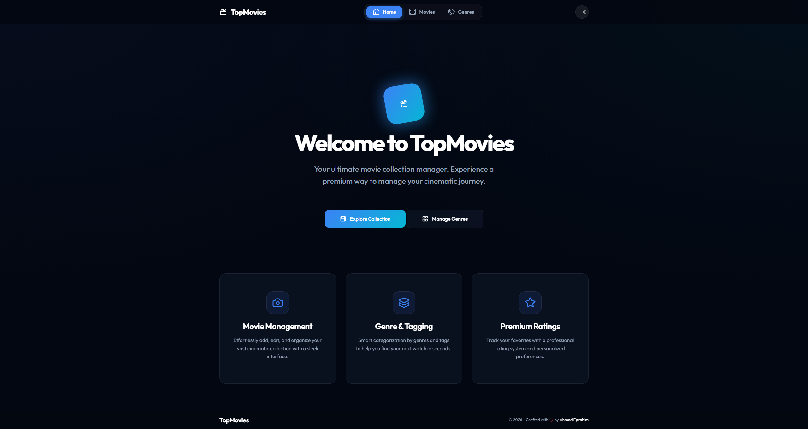
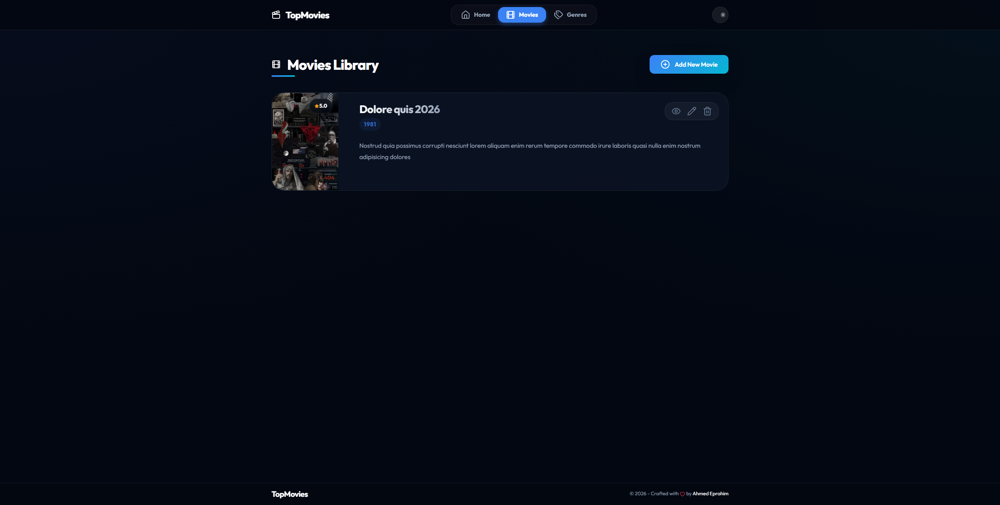
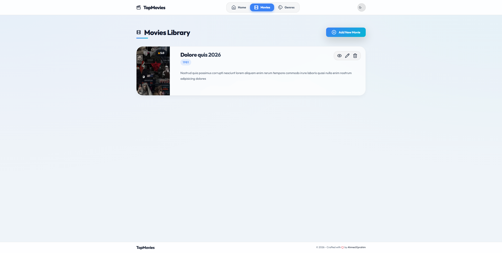

# 🎬 TopMovies

[](https://dotnet.microsoft.com/download/dotnet/10.0)
[](https://opensource.org/licenses/MIT)

**TopMovies** is a high-fidelity movie library management system built with **ASP.NET Core 10 MVC**. It combines a robust backend with a stunning, cinematic frontend designed for the ultimate user experience.

---

## ✨ Key Features

- **🎥 Cinematic Movie Catalog**: A visually rich grid layout for exploring movie collections.
- **🌓 Dynamic Theme Engine**: First-class support for **Dark** and **Light** modes with persistent user preference.
- **💎 Glassmorphic UI**: Modern aesthetic using backdrop blurs, subtle gradients, and floating surfaces.
- **🏷️ Genre Intelligence**: organize and filter movies by custom genres with dedicated management.
- **🖼️ Poster Management**: Integrated image handling for high-quality movie artwork.
- **⚡ Real-time Feedback**: Smooth, non-blocking notifications powered by **NToastNotify**.
- **🔍 Fluid Animations**: Micro-interactions and hover effects for a responsive feel.

---

## 📸 Screenshots

| Home Page | Dark Mode | Light Mode |
| :---: | :---: | :---: |
|  |  |  |

---

## 🚀 Tech Stack

### Backend
- **Framework**: ASP.NET Core 10.0 MVC
- **Database**: SQL Server
- **ORM**: Entity Framework Core
- **Middleware**: Custom Global Exception Handling
- **Compilation**: Razor Runtime Compilation enabled

### Frontend
- **Design**: Premium Glassmorphism Architecture
- **Typography**: `Outfit` & `Inter` (Google Fonts)
- **Icons**: Lucide Icons
- **Interop**: jQuery & Bootbox.js
- **Styling**: Modern CSS Variables & Utility-first Layouts

---

## 📁 Project Structure

```text
TopMovies/
├── Controllers/       # Logic for Movies, Genres, and Home
├── Data/              # ApplicationDbContext & Migrations
├── Entities/          # Domain Models (Movie, Genre)
├── Views/             # Razor Views & Layouts
├── wwwroot/           # Static assets (Custom CSS, JS, Libs)
├── ViewModels/        # Data Transfer Objects for Views
└── Middleware/        # Custom Pipeline components
```

---

## 🛠️ Setup & Installation

### Prerequisites
- [.NET 10 SDK](https://dotnet.microsoft.com/download/dotnet/10.0)
- [SQL Server](https://www.microsoft.com/en-us/sql-server/sql-server-downloads)

### Installation Steps

1. **Clone the repository**
   ```bash
   git clone https://github.com/AhmedIbrahim-tech/TopMovies.git
   cd TopMovies
   ```

2. **Configure Database**
   Update `TopMovies/appsettings.json` with your connection string:
   ```json
   "ConnectionStrings": {
     "DefaultConnection": "Server=YOUR_SERVER;Database=TopMovies;Trusted_Connection=True;TrustServerCertificate=True;"
   }
   ```

3. **Initialize Database**
   ```bash
   dotnet ef database update
   ```

4. **Launch Application**
   ```bash
   dotnet run --project TopMovies
   ```

---

## 🎨 Design Philosophy

The UI is built on a **Glassmorphic Design System**:
- **Transparency**: Cards and navigation use `backdrop-filter: blur()` for depth.
- **Gradients**: Subtle primary-to-accent gradients for meaningful highlights.
- **Theming**: A robust CSS variable system ensures consistency across modes.
- **Interaction**: Every action has a visual confirmation through Lucide icons and Toastr.

---

## 📜 License

Distributed under the MIT License. See `LICENSE` for more information.

---

## 👨‍💻 Developed By

**Ahmed Eprahim**  
[GitHub](https://github.com/AhmedIbrahim-tech) | Movie Library Modernization Project 🎬
